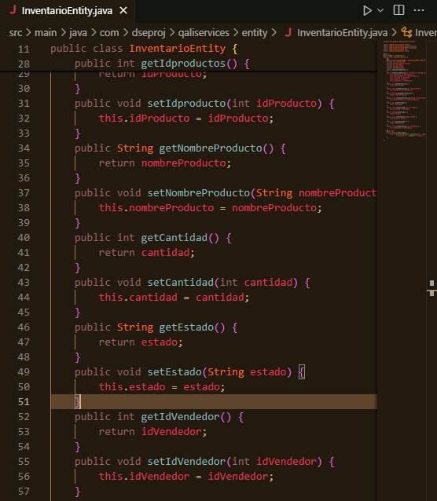
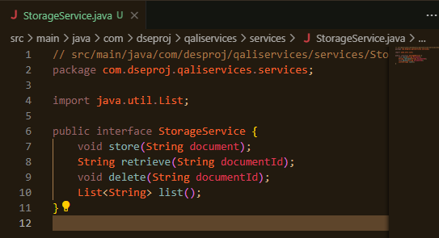
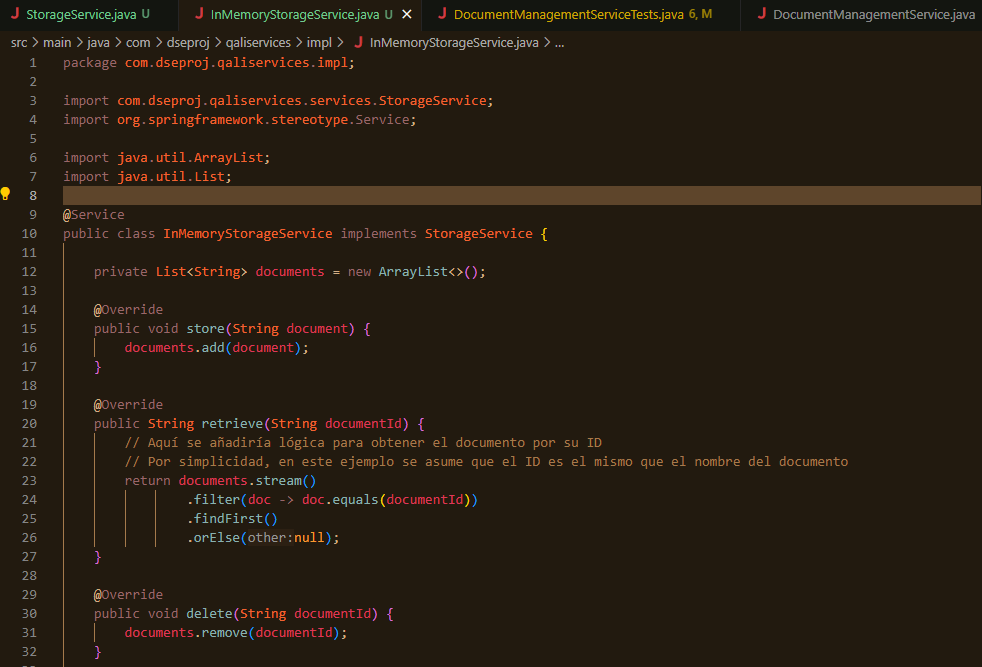
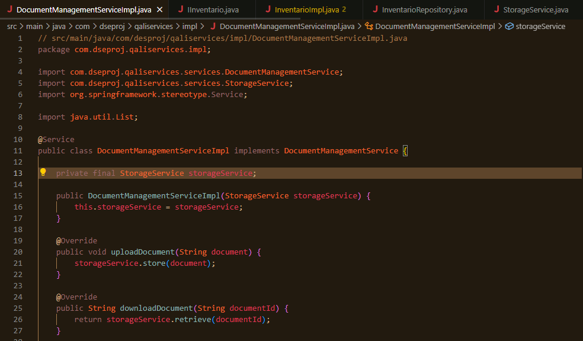

# 🛠️ Proyecto BPMN en Bonitasoft

Bienvenido al repositorio del Proyecto BPMN en Bonitasoft. Aquí encontrarás toda la documentación necesaria sobre el proyecto, sus procesos y su arquitectura. 

## 🏆 Nombre del Equipo y Miembros

- **Equipo de Trabajo:** DSE Qaliwarma Project
  - **Integrantes:**
    - Santiago Vilca Limachi
    - Edson Bryan Béjar Román
    - Patrik Ramirez Zarate
    - [Nombre del Integrante 4]

## 🏢 Cliente: Programa Nacional de Alimentación Escolar Qali Warma.

El nombre de la empresa seleccionada es: Programa Nacional de Alimentación Escolar Qali Warma.

## 🎯 Propósito del Proyecto

El propósito de este proyecto es implementar una solución de **Business Process Management (BPM)** que permita automatizar y gestionar los procesos de negocio de la organización Qaliwarma, mejorando así la eficiencia y la visibilidad de las operaciones.

## 🌟 Visión General

La aplicación BPM incluye:

- **Application Page:** Página principal de la aplicación donde se visualizan y gestionan los procesos.
- **Menú:** Menú de navegación para acceder a las diferentes funcionalidades de la aplicación.

## 📊 Procesos de Negocio

### A continuación, se presenta una breve descripción de los procesos de negocio implementados:

- ### Proceso 1:
Aprobación del cronograma de convocatoria, bases estandarizadas para el proceso de compras, elaboración y actualización de documentos normativos.
  

**Descripción del proceso:**

Este proceso garantiza una revisión exhaustiva y cumplimiento normativo del Manual de Operaciones antes de su implementación. La Unidad de Planeamiento prepara y envía el manual para revisión. La Dirección Ejecutiva y la Asesoría Jurídica revisan el manual para asegurar su precisión y cumplimiento legal. Finalmente, MIDIS aprueba el manual y la Coordinación General de Gestión de Contratos lo implementa. Este flujo estructurado asegura que el manual esté completamente validado y listo para su aplicación efectiva.

**FASE 1: Planificación**
  - **1.1 Unidad de Planeamiento, Presupuesto y Modernización**
    - **1.1.1 Planificar el Manual de Operaciones**
      - Prepara una versión preliminar del manual.
    - **1.1.2 Mandar el Manual de Operaciones para Revisión**
      - Envía el manual preliminar a la **Dirección Ejecutiva** para su revisión.

**FASE 2: Revisión del Manual de Operaciones**
  - **2.1 Dirección Ejecutiva**
     - **2.1.1 Recibir el Manual de Operaciones**
       - Recepción del manual enviado por la **Unidad de Planeamiento**.
     - **2.1.2 Revisar el Manual de Operaciones**
       - Verifica el contenido del manual. Si requiere cambios, se reenvía para corrección.
  - **2.2 Asesoría Jurídica**
    - **2.2.1. Verificar que el Manual de Operaciones corresponde legalmente**
       - Asegura el cumplimiento legal del manual. Si es correcto, notificar a la **Dirección Ejecutiva**.
  - **3.3 MIDIS**
    - **3.3.1 Recibir el Manual de Operaciones**
      - Recepción del manual aprobado por la **Dirección Ejecutiva**.
    - **3.3.2 Revisión del Manual de Operaciones**
      - Realiza una revisión final. Si requiere cambios, notificar y reenviar para corrección.

**FASE 3: Ejecución del Manual de Operaciones**
  - **3.1 Coordinación General de Gestión de Contratos de Servicios Alimentarios**
    - **3.1.1 Oficializar la Aprobación del Manual de Operaciones**
       - Comunica la aprobación del manual a todas las partes interesadas.
    - **3.1.2 Comenzar la Ejecución del Programa Alimentario siguiendo el Manual de Operaciones Aprobado**
       - Inicia la ejecución del programa conforme a las directrices del manual aprobado.

  
- ### Proceso 2: Selección de proveedores.
  

**Descripción del proceso:**

Este diagrama describe el proceso de selección de proveedores. El flujo comienza con la recopilación de información sobre los proveedores potenciales, luego, se definen los criterios de selección que serán usados para evaluar los proveedores.
El proceso inluye una evaluación inicial para determinar si los proveedores cumplen con los requisitos establecidos. Si los cumplen, se realizan una evaluación más detallada, seguida de ajustes y la aprobación de la solicitud. Si no cumplen, se notifica el rechazo y el proceso termina.
Generalmente, el proceso asegura que solo los proveedores que cumplen con los criterios predefinidos avanzan en el proceso de selección.

### Pasos del Proceso:

1. **Inicio del Proceso**
   - El proceso comienza con el evento de inicio "Inicio1", que es activado por un empleado.

2. **Recopilación de Información de Proveedores**
   - Se realiza una recopilación de información sobre los proveedores potenciales. Esta actividad es realizada por el empleado y es seguida por un "Evento de tiempo no interruptor".

3. **Definición y Criterios de Selección**
   - Se definen los criterios de selección que serán utilizados para evaluar a los proveedores.

4. **Evaluación Inicial de Proveedores**
   - Se lleva a cabo una evaluación inicial de los proveedores para determinar si cumplen con los requisitos establecidos en los criterios de selección.

5. **Decisión sobre los Requisitos**
   - Hay una decisión basada en si los proveedores cumplen o no con los requisitos.
     - Si **cumplen con los requisitos**, se procede a la "Evaluación de proveedores detallada y ajustes".
     - Si **no cumplen con los requisitos**, se envía una "Notificación de rechazo".

6. **Evaluación de Proveedores Detallada y Ajustes**
   - Para los proveedores que cumplieron con los requisitos iniciales, se realiza una evaluación más detallada y se hacen los ajustes necesarios.

7. **Fin del Proceso**
   - El proceso termina de dos maneras posibles:
     - **Solicitud Aprobada**: Si los proveedores pasan la evaluación detallada, la solicitud es aprobada.
     - **Solicitud Rechazada**: Si no pasan la evaluación inicial, se notifica el rechazo de la solicitud.

- ### Proceso 3: Adquisición y distribución de alimentos.

**Descripción del proceso:**
Este proceso asegura una planificación buena y eficiente, la organización de los pedidos, y una correcta distribución y recepción de alimentos en las unidades territoriales.

**Etapas del proceso:**

**1. Planificación y Presupuesto:**

  - **1.1 Recepción de Alimentos:**
    - El proceso comienza con la recepción de una lista de alimentos.
  - **1.2 Generación de Presupuesto:**
    - Se genera un presupuesto basado en la lista de alimentos.
  - **1.3 Evaluación de Financiamiento:**
    - Se realiza una evaluación para determinar si los alimentos pueden financiarse.
      - **1.3.1** Si no es posible, se ajusta el informe.
      - **1.3.2** Si es posible, se envía el informe final.

**2. Generación y Organización de Pedidos:**

  - **2.1 Recepción del Informe Final:**
    - El informe final es recibido por la unidad de gestión.
  - **2.2 Organización de Comités de Compra:**
    - Se organizan comités de compra para dividir los pedidos entre proveedores.
  - **2.3 Generación y Envío de Pedidos:**
    - Tras la división, se generan y envían los pedidos a los proveedores.

**3. Logística y Distribución:**

  - **3.1 Organización de Pedidos:**
    - Los pedidos recibidos se organizan por unidades territoriales.
  - **3.2 Generación de Rutas de Entrega:**
    - Se generan las rutas de entrega.
  - **3.3 Notificación de Entrega:**
    - Se notifica a las unidades sobre los días de entrega.

**4. Recepción y Supervisión:**

  - **4.1 Recepción de Pedidos en Unidades Territoriales:**
    - En las unidades territoriales, se reciben y revisan los pedidos.
  - **4.2 Supervisión de Entregas:**
    - Finalmente, se supervisa la entrega adecuada y se notifica el recibimiento de los productos.

  
- ### Proceso 4: Planificación del menú escolar.
  

**Descripción del proceso:**

El proceso garantiza que el menú escolar sea cuidadosamente planificado, cumpla con los estándares nutricionales y se ajuste a las necesidades y preferencias de estudiantes antes de ser aprobado y enviado para su implementación.

La participación de los padres y el comité escolar en la retroalimentación asegura un enfoque inclusivo y orientado a esa comunidad.

**Etapas del proceso:**

  - **1. Recepción y Recopilación de Datos**
    - **1.1 Recepción de Productos:** 
      - El proceso comienza con la recepción de productos, lo que indica la disponibilidad de ingredientes para la planificación del menú.
    - **1.2 Recopilación de Preferencias y Necesidades:** 
      - Se recopilan datos sobre las preferencias y necesidades alimenticias de los estudiantes, lo que puede incluir alergias, restricciones dietéticas, y preferencias culturales.

  - **2. Análisis y Formulación del Menú**

    - **2.1 Análisis de Datos:** 
      - Se analizan los datos recopilados para asegurar que se ajusten a los requisitos nutricionales y a las necesidades de los estudiantes.
    - **2.2 Cumple Estándar Nutricional:** 
      - Se realiza una verificación para determinar si el menú propuesto cumple con los estándares nutricionales. 
      - Si no cumple, se reformula el menú.
    - **2.3 Reformulación:** 
      - Si es necesario, se realizan ajustes al menú para cumplir con los estándares nutricionales.

  - **3. Presentación y Aprobación del Menú**
    - **3.1 Presentación del Menú:** 
      - Una vez que el menú cumple con los estándares, se presenta a las partes interesadas, que en este caso pueden ser los padres de familia o el comité escolar.
    - **3.2 Encuesta:** 
      - Se puede llevar a cabo una encuesta para recoger opiniones o sugerencias sobre el menú propuesto.

  - **4. Aprobación del Menú**

    - **4.1 Aprobar Menú:** 
      - Se decide si el menú es aprobado o no. 
        - Si es aprobado, el proceso avanza.
        - Si no es aprobado, se proporciona retroalimentación y se realizan los ajustes necesarios.
    - **4.2 Retroalimentar:** 
      - En caso de que el menú no sea aprobado, se devuelve con comentarios para su revisión y ajustes.
    - **4.3 Añadir a las Opciones del Menú:** 
      - Una vez que se cumplen todos los criterios, el menú es añadido a las opciones disponibles.

  - **5. Notificación y Envío del Menú**
    - **5.1 Notificar Aprobación:** 
      - Se notifica la aprobación del menú a las entidades responsables.
    - **5.2 Menú enviado al ente ejecutor:** 
      - Finalmente, el menú aprobado se envía a la entidad encargada de su ejecución.

  
- ### Proceso 5: Convocatoria y conducción del proceso de compras según las bases y el manual de aprobados.
  

**Descripción del proceso:**

Este proceso involucra múltiples pasos desde la redacción de las bases para una convocatoria, pasando por la aprobación de ofertas, la emisión y recepción de órdenes de compra, hasta la entrega de productos y la gestión de pagos. Cada actor tiene roles específicos y puntos de decisión que aseguran la correcta ejecución y seguimiento del proceso de compras.

**Etapas del proceso:**

- **1. Responsable de Compras:**
  - **1.1 Preparación de la Convocatoria:**
    - Todo comienza con la redacción de las bases para la convocatoria.
    - Una vez redactadas, estas bases deben ser validadas.
    - Si son aprobadas, se procede a la publicación de la convocatoria.
  - **1.2 Publicación de la Convocatoria:**
    - Después de validar las bases, se notifica la aprobación.
    - Si las bases no son aprobadas, se notifica el rechazo y se reformulan las bases.
  - **1.3 Aprobación de Oferta:**
    - Las ofertas recibidas son revisadas y aprobadas.
    - Una vez que una oferta es aprobada, se notifica al oferente y se envía una orden de compra.

- **2. Administrador del Sistema:**
  - **2.1 Procesamiento de Pagos:**
    - Cuando se recibe una factura, se registra y se procesa el pago al proveedor.
    - Luego, se actualiza el registro de compras para mantener todo en orden.
  - **2.2 Recepción de Factura:**
    - Este paso asegura que todas las facturas sean recibidas y registradas correctamente antes de proceder con el pago.

- **3. Contratista o Proveedor:**
  - **3.1 Elaboración de Ofertas:**
    - El proveedor prepara su oferta y la presenta.
    - Si la oferta necesita ajustes, se replantea y valida nuevamente.
    - Una vez aprobada, se notifica al proveedor.
  - **3.2 Recepción de Órdenes de Compra:**
    - Tras recibir la orden de compra, el proveedor prepara los productos solicitados.
  - **3.3 Entrega de Productos:**
    - El proveedor entrega los productos y crea la factura correspondiente para el pago.

- **4. Control de Ejecución:**
  - **4.1 Confirmación de la Oferta:**
    - Aquí, se adjudica el contrato y se firma.
    - El proveedor confirma y recibe la oferta, asegurando que todo esté en orden antes de proceder.
  - **4.2 Recepción de Notificación de Oferta Aceptada:**
    - Una vez aceptada la oferta, el proveedor recibe la notificación oficial.
  - **4.3 Recepción de Orden de Compra:**
    - Con la orden de compra en mano, el proveedor prepara y entrega los productos.

  
- ### proceso 6: Gestión de Inventarios locales.
  

**Descripción del proceso:**

El proceso asegura que los productos recibidos sean verificados y almacenados adecuadamente, asegurando que estén en buen estado antes de ser utilizados. La organización y rotulación ayudan a gestionar el inventario de manera eficiente, evitando pérdidas por vencimiento y asegurando la disponibilidad de productos en buen estado.

**Etapas del proceso:** 

- **1. Unidades Territoriales:**
  - **1.1 Inicio:**
    - El proceso comienza cuando los productos llegan a la unidad territorial.
  - **1.2 Enviar Productos a los Comités de Alimentación Escolar:**
    - Los productos se envían a los comités correspondientes para su distribución.

- **2. Gestión de Inventarios CAE (Comités de Alimentación Escolar):**
  - **2.1 Notificar Llegada de los Productos:**
    - Se notifica la recepción de los productos a la unidad encargada.
  - **2.2 Verificar Productos Recibidos:**
    - Se verifica que los productos recibidos coincidan con los detalles del acta de entrega. Aquí hay dos posibles caminos:
      - **2.1.1 Recepción = Acta de Entrega:**
        - Si los productos coinciden con el acta de entrega, se procede a revisar su estado.
      - **2.1.2 Recepción ≠ Acta de Entrega:**
        - Si hay discrepancias, se anotan las observaciones pertinentes.

- **3. Revisión de Productos:**
  - **3.1 Revisar Estado de los Productos:**
    - Se inspecciona si los productos están en buen estado, considerando factores como la fecha de vencimiento y posibles daños (golpes, etc.). Nuevamente, hay dos caminos posibles:
      - **3.1.1 Producto en Buen Estado:**
        - Si los productos están en buen estado, se guardan en el inventario.
      - **3.1.2 Producto en Mal Estado:**
        - Si los productos no están en buen estado, se anotan las observaciones correspondientes.

- **4. Organización y Rotulación:**
  - **4.1 Organizar Productos:**
    - Los productos se organizan en función de su fecha de vencimiento.
  - **4.2 Rotular Productos:**
    - Se rotulan con la fecha de vencimiento, fecha de ingreso y fecha de salida, para un manejo adecuado del inventario.

- **5. Finalización del Proceso:**
  - **5.1 Productos Listos para su Uso:**
    - Finalmente, los productos están listos para ser utilizados según las necesidades.

## Proceso Implementado con servicios Externos

- **Proceso 1:** Gestion de Inventarios.

### Se puede marcar la casilla si hay mas productos para verificar

### Se verifica que se almacenan en la tabla

### Se envian correos

### Se envia emails de notificaciones

  
## 🏗️ SOA: Servicios de Soporte a Tareas Automáticas

Los servicios de soporte están basados en el estándar **OpenAPI** y utilizan la herramienta **Swagger** para la documentación y prueba de API.

### 📦 Recursos

- **Nombre del Recurso:** Gestion de Inventarios
  - **Operaciones Disponibles:**
    - **Método:** GET
      **URLs:** /proj/inventarios/listar  
      **Parámetros:** NO PARAMETERS
      
    - **Métodos:** POST  
      **URLs:** /proj/inventarios/editar/{id}
      **Parámetros:** [id]
      
    - **Métodos:** DELETE
      **URLs:** /proj/inventarios/eliminar/{id}
      **Parámetros:** [id]
      
    - **Métodos:** POST
      **URLs:** /proj/inventarios/guardar
      **Parámetros:** [body]
     
      
- **Nombre del Recurso:** Gestion de Documentos
  - **Operaciones Disponibles:**
    - **Métodos:** POST
      **URLs:** /documents/upload/
      **Parámetros:** [body]
      
    - **Métodos:** GET
      **URLs:** /documents/list/
      **Parámetros:** NO PARAMETERS
      
    - **Métodos:** GET
      **URLs:** /documents/download/{id}
      **Parámetros:** [id]
      
    - **Métodos:** DELETE
      **URLs:** /documents/delete/{id}
      **Parámetros:** [id]

### 🏛️ Modelos

- **Entidades Clave:** Descripción de las entidades clave del sistema.
- **Agregados:** Descripción de los agregados utilizados.
- **Módulos:** Descripción de los módulos clave.

## 📜 SOLID: Aplicación de los prinicipios

Aquí explicamos cómo aplicamos los principios SOLID en nuestro proyecto

### ✅ Single Responsibility Principle (Principio de responsabilidad única)

Este principio se aplica en la definición de clases y métodos, aquí se puede ver la clase InventarioEntity donde se definen métodos para obtener y cambiar las variables necesarias sin interferir con otros dependencias, cada método se encarga solo de su funcionalidad

### ✅ Open-Closed Principle (Principio Abierto-Cerrado)

Este principio se aplica cuando deseamos que nuestro sistema sea fácil de extender sin necesidad de modificar el código existente. Por ahora se usa una lista para guardar los documentos existentes, pero si en el futuro se desea cambiar la forma en que se almacenan los documentos (por ejemplo, en una base de datos o en un sistema de almacenamiento en la nube), se necesitaría modificar DocumentManagementServiceImpl. Entonces para evitar esto, definimos una interfaz para el almacenamiento de documentos. Esto permite cambiar el mecanismo de almacenamiento sin afectar la lógica de gestión de documentos.

De esta manera, podemos crear diferentes implementaciones de StorageService sin cambiar DocumentManagementServiceImpl. En nuestro caso, creamos la implementación de guardado en memoria y definimos la que implementa un guardado en una base de datos.

### ✅ Dependency Inversion Principle (Principio de inversión de dependencia)

El principio de inversión de dependencia establece que nuestras clases deben depender de interfaces o clases abstractas en lugar de clases y funciones concretas. Se relaciona mucho con el principio Abrierto-Cerrado. Las clases de alto nivel no deben depender de clases de bajo nivel. Ambas deben depender de abstracciones. En nuestro proyecto al implementar StorageService, DocumentManagementServiceImpl no depende de clases de bajo nivel como InMemoryStorageService y DatabaseStorageService sino directamente una interfaz o abstracción como lo es StorageService.

## 🔄 Diagrama de Composición de Servicios
Aquí se detalla el diagrama de composición de servicios a través de los procesos de negocio.
El diagrama está dividido en varias capas, cada una con sus propios módulos y componentes.

### 1. Capa de presentación:
Esta capa se encarga de la interacción con el usuario, proporcionando interfaces y visualizaciones para el funcionamiento del sistema.
  - **Paquete de Proveedores:**
    - La Clase **Empleado** con atributos **id**, **nombre** y **rol**.
      - Rol: Representa al empleado que interactúa con el sistema.
      - Conexión: Interactúa con las capas de gestión de documentos y lógica de negocios.
  - **Paquete de Empleados:**
    - La Clase **Empleado** con atributos **id**, **nombre** y **rol**.
      - Rol: Representa al empleado que interactúa con el sistema.
      - Conexión: Interactúa con las capas de gestión de documentos y lógica de negocios.
  - **Paquete CAE y Padre de Familia:**
    - La Clase **CAE**, **Padre de Familia** con atributos **id**, **nombre** y **telefono**.
      - Rol: Representa usuarios finales que interactúan con el sistema para tomar decisiones decisiones sobre menús escolares.
      - Conexión: Se comunican con la lógica de negocios par definir criterios y elegir menús.

### 2. Capa de Lógica de Negocios:

Esta capa maneja la lógica emresarial del sistema, gestionando las operaciones y procesos de negocio.

  - **Gestión de Proveedores de Servicios:**
    - Clase **GestiónProveedoresServicios** con métodos **listarProveedores**, **agregarProveedor**, **eliminarProveedor**, y **evaluarProveedor**.
      - Rol: Gestiona y evalúa proveedores de servicios.
      - Conexión: Interactúa con las clases **ProveedorDAO**, **EvaluacionDAO**, y **CriteriosDAO** en la capa de acceso a datos.
  - **Evaluación de Proveedores de Servicios:**
    - Clase **EvaluaciónProveedoresServicios** con métodos **historialDesempeño** y **mapProveedor**.
      - Rol: Evalúa el desempeño de los proveedores basándose en criterios definidos.
      - Conexión: Interactúa con **ProveedorDAO** y **EvaluacionDAO**.
  - **Definición de Criterios de Servicio:**
    - Clase **DefiniciónCriteriosServicio** con métodos **agregarCriterio**, **eliminarCriterio**, y **listarCriterios**.
      - Rol: Define y gestiona los criterios de evaluación para los proveedores.
      - Conexión: Se comunica con **CriteriosDAO**.

### 3. Capa de Gestión de Documentos:

Esta capa se encarga de gesteionar la documentación del sistema, incluyendo la creación, revisión, aprobación y publicación de documentos.

  - **Gestión de Documentos:**
    - Clase **GestiónDocumentos** con métodos **crearDocumento**, **eliminarDocumento**, y **editarDocumento**.
      - Rol: Gestiona la creación, edición y eliminación de documentos.
      - Conexión: Interactúa con la clase **RepositorioDocumentos** en la capa de infraestructura.

  - **Revisión Documental:**
    - Clase **RevisiónDocumental** con métodos **iniciarRevisión** y **aprobarRevisión**.
      - Rol: Gestiona el proceso de revisión y aprobación de documentos.
      - Conexión: Se comunica con **RepositorioDocumentos**.

  - **Aprobación Documentaria:**
    - Clase **AprobaciónDocumentaria** con métodos **aprobarDocumento** y **objetarDocumento**.
      - Rol: Gestiona la aprobación final de los documentos.
      - Conexión: Interactúa con **RepositorioDocumentos**.

  - **Publicación:**
    - Clase **Publicación** con métodos **iniciarPublicación** y **finalizarPublicación**.
      -  Rol: Gestiona la publicación de documentos aprobados.
      - Conexión: Se comunica con **RepositorioDocumentos**.
      
### 4. Capa de Acceso a Datos:

Esta capa maneja la persistencia y recuperación de datos del sistema.
  - **ProveedorDAO:**
    - Clase **ProveedorDAO** con métodos **listarProveedores**, **agregarProveedor**, y **eliminarProveedor**.
      - Rol: Accede y manipula datos de los proveedores en la base de datos.
      - Conexión: Interactúa con **GestiónProveedoresServicios**.

  - **EvaluaciónDAO:**
    - Clase **EvaluaciónDAO** con métodos **listarEvaluaciones** y **agregarEvaluación**.
      - Rol: Accede y manipula datos de las evaluaciones en la base de datos.
      - Conexión: Se comunica con **EvaluaciónProveedoresServicios**.

  - **CriteriosDAO:**
    - Clase **CriteriosDAO** con métodos **listarCriterios**, **agregarCriterio**, y **eliminarCriterio**.
      - Rol: Accede y manipula datos de los criterios de evaluación en la base de datos.
      - Conexión: Interactúa con **DefiniciónCriteriosServicio**.

### 5. Capa de Infraestructura:
Esta capa proporciona servicios esenciales y de apoyo al resto del sistema, gestionando los recursos y la infraestructura.
  - **RepositorioDocumentos:**
    - Clase **RepositorioDocumentos** con métodos **guardarDocumento**, **eliminarDocumento**, **actualizarDocumento**, y **obtenerDocumento**.
      - Rol: Gestiona el almacenamiento y recuperación de documentos en el sistema.
      - Conexión: Interactúa con las clases **GestiónDocumentos**, **RevisiónDocumental**, **AprobaciónDocumentaria**, y **Publicación**.
      - 
### 6. Capa de Dominio:
Esta capa maneja la lógica específica de dominio y las reglas de negocio.
  - **Agente Interno:**
    - Clase **AgenteInterno** con atributos **nombre**, **id**, y **responsabilidades**.
      - Rol: Representa a un agente interno del sistema con ciertas responsabilidades.
      - Conexión: Se comunica con la clase **GestiónInventarios**.

  - **Compra:**
    - Clase **Compra** con atributos **id**, **fecha**, **formaDePago**, y métodos **agregarProducto** y **cancelarCompra**.
      - Rol: Gestiona las compras realizadas en el sistema.
      - Conexión: Interactúa con **GestionInventarios**.
     
### 7. Otros Componentes:

- Gestión de Inventarios:
  - Clase **GestionInventarios** con métodos **añadirProducto**, **eliminarProducto**, **actualizarProducto**, **mostrarProducto**.
    - Rol: Gestiona el inventario de productos.
    - Conexión: Interactúa con **AgenteInterno** y **Compra**.

Este diagrama proporciona una estructua clara y organizada para la gestión de proveedores, documentos y servicios dentro de un mismo sistema. Cada capa tiene roles y responsabilidades específicas con clases y también interfaces que aseguran una interacción eficiente y coherente entre los diferentes componentes del sistema. La capa de presentación se encarga de la interacción del usuario, la lógica de negocios maneja las reglas de negocio, la gestión de documentos asegura el flujo adecuado de documentos, el acceso a datos facilita la manipulación de la base de datos y la infraestructura garantiza el almacenamiento seguro y eficiente de los documentos. La capa de dominio representa entidades clave y procesos de negocio que interactúan con las otras capas para cumplir los objetivos del sistema.

## 📄 Documentación Adicional

Para más detalles sobre la implementación, puedes consultar los documentos adicionales en la carpeta `docs`.

---

¡Gracias por visitar el repositorio del Proyecto BPMN en Bonitasoft! Si tienes alguna pregunta o necesitas más información, no dudes en ponerte en contacto con nosotros. 🚀
